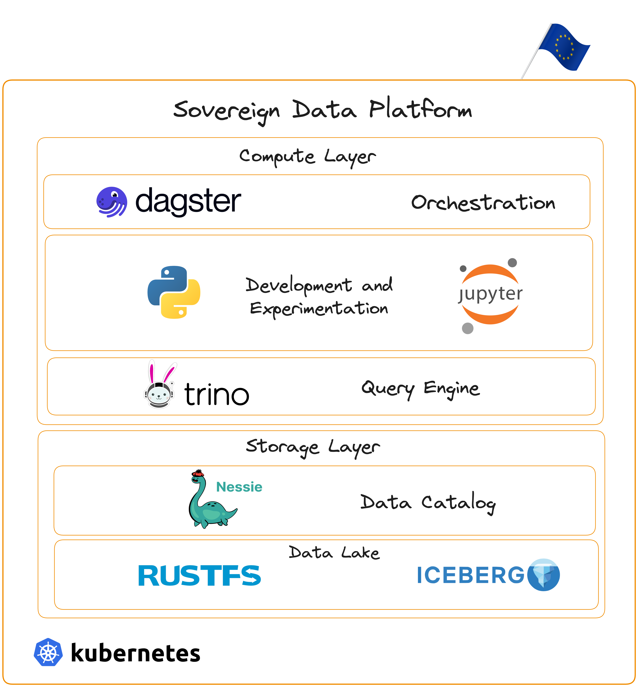

# sovereign-dp - Data Platform to be deployed on your machine(s)



**A sovereign data lakehouse platform built entirely on open-source technologies.**

This project demonstrates that you don't need to depend on AWS, Azure, or GCP for your data infrastructure. By combining mature open-source tools, you can build a complete data platform that runs on any Kubernetes cluster you control.

**What's inside:**
- **Apache Iceberg** for ACID transactions on data lakes
- **Trino** as distributed SQL query engine
- **Nessie** for version control of data
- **rustfs** for S3-compatible object storage
- **JupyterHub** for interactive data analysis
- **Dagster** for data orchestration (optiona)

This is a local development environment and proof of concept—not a production-ready system. But it proves what's possible when we build with sovereignty in mind.

## Quick Start

### Prerequisites

- [Docker Desktop](https://www.docker.com/products/docker-desktop/) (or [Docker Engine](https://docs.docker.com/engine/install/))
- [kubectl](https://kubernetes.io/docs/tasks/tools/)
- [Helm 3](https://helm.sh/docs/intro/install/)
- [kind](https://kind.sigs.k8s.io/docs/user/quick-start/#installation) (will be installed by setup script if needed)

### Minimum System Requirements

The platform runs multiple services that require adequate resources:

| Configuration | Memory | CPUs | Notes |
|--------------|--------|------|-------|
| **Minimum** | 10 GB | 4 | Basic functionality, may experience slowdowns |
| **Recommended** | 16 GB | 6 | Smooth operation with JupyterHub notebooks |
| **With Dagster** | 20 GB | 8 | Full stack including orchestration |

**Docker Desktop users**: Go to Settings → Resources and allocate at least the minimum memory/CPUs above.

### Setup

#### Option 1: All-in-One Deployment (Recommended)

Deploy the entire stack with a single command:

```bash
./scripts/deploy-all.sh
```

This script will automatically:
1. Create the Kubernetes cluster
2. Install Helm
3. Deploy Nessie catalog
4. Deploy rustfs object storage
5. Configure credentials
6. Deploy Trino query engine
7. Deploy JupyterHub notebooks

To include Dagster orchestration:

```bash
./scripts/deploy-all.sh --with-dagster
```

#### Option 2: Step-by-Step Deployment

Alternatively, run the setup scripts individually:

```bash
./scripts/setup-cluster.sh      # 1. Create Kubernetes cluster
./scripts/install-helm.sh        # 2. Install Helm (if needed)
./scripts/setup-nessie.sh        # 3. Deploy Nessie catalog
./scripts/setup-rustfs.sh        # 4. Deploy rustfs object storage
./scripts/setup-credentials.sh   # 5. Configure credentials
./scripts/setup-trino.sh         # 6. Deploy Trino query engine
./scripts/setup-jupyterhub.sh    # 7. Deploy JupyterHub
./scripts/setup-dagster.sh       # 8. Deploy Dagster (optional)
```

### Access Services

Once deployed, the following web UIs are available:

| Service | URL | Credentials | Description |
|---------|-----|-------------|-------------|
| **rustfs Console** | http://localhost:9001 | user: `rustfsadmin`, pass: `rustfsadmin` | Object storage browser - view buckets, upload files, manage S3 objects |
| **Trino Web UI** | http://localhost:8080 | No authentication required | Query monitor - view running queries, query history, cluster status, worker nodes |
| **JupyterHub** | http://localhost:8888 | user: any username, pass: `jupyter` | Interactive notebooks - run SQL queries, analyze data, create visualizations |
| **Dagster UI** | http://localhost:3000 | No authentication required | Pipeline orchestration - trigger jobs, view runs, monitor assets (only if deployed with `--with-dagster`) |

#### Nessie UI (Catalog Browser)

Nessie provides a web UI for browsing the data catalog, viewing table history, and managing branches. It's not exposed externally by default, but you can access it via port-forward:

```bash
# Start port-forward to Nessie
kubectl port-forward -n sovereign-dp svc/nessie 19120:19120

# Then open in browser
open http://localhost:19120
```

The Nessie UI allows you to:
- Browse namespaces and tables in the catalog
- View commit history (similar to git log)
- Create and manage branches for data versioning
- Compare differences between branches

#### API Endpoints

For programmatic access:

| Service | URL | Description |
|---------|-----|-------------|
| rustfs S3 API | http://localhost:9000 | S3-compatible API for object storage |
| Nessie REST API | Internal: `http://nessie.sovereign-dp:19120/api/v2` | Iceberg catalog REST API |
| Trino | Internal: `http://trino.sovereign-dp:8080` | JDBC/HTTP endpoint for SQL queries |

### Test the Platform

#### Option 1: Using JupyterHub Notebooks (Recommended)

**Step 1: Access JupyterHub**
1. Open your browser and navigate to http://localhost:8888

**Step 2: Login**
1. Enter any username (e.g., `admin` or your name)
2. Enter password: `jupyter`
3. Click "Sign In"
4. Wait for your notebook server to spawn (this may take 30-60 seconds on first login)

**Step 3: Run the Demo Notebook**
1. In the file browser, open `trino-iceberg-demo.ipynb`
2. Run cells sequentially using `Shift+Enter`
3. The notebook will:
   - Connect to Trino and verify the connection
   - Show available catalogs and schemas
   - Create a demo schema and sample sales table
   - Insert sample data and run analytical queries
   - Generate a revenue visualization chart
   - Demonstrate Iceberg time travel (table snapshots)

The notebook environment includes:
- `trino` - Python client for Trino/Iceberg
- `pandas`, `matplotlib`, `seaborn` - Data analysis and visualization
- `ipython-sql` - SQL magic commands for inline queries

#### Option 2: Using Trino CLI

```bash
# Connect to Trino CLI
kubectl exec -n sovereign-dp deploy/trino-coordinator -it -- trino

# Run SQL query
trino> SHOW CATALOGS;
trino> CREATE SCHEMA iceberg.demo;
trino> CREATE TABLE iceberg.demo.test (id int, name varchar);
```

## Architecture

The platform consists of:

- **Kubernetes** (kind) - Container orchestration
- **rustfs** - S3-compatible object storage (Rust-based, faster than MinIO)
- **Nessie** - Git-like version control for data lakehouse tables
- **Trino** - Distributed SQL query engine
- **Apache Iceberg** - Open table format with ACID transactions
- **JupyterHub** - Interactive notebook environment for data analysis
- **Dagster** - Data orchestration platform (optional)

### Data Flow

1. **Ingest**: Data lands in rustfs buckets (S3-compatible)
2. **Catalog**: Nessie tracks table metadata with git-like versioning
3. **Tables**: Apache Iceberg provides ACID transactions and time travel
4. **Query**: Trino provides distributed SQL access to all data

### Storage

- rustfs buckets: `sovereign-dp`, `warehouse`
- Iceberg warehouse: `s3://lakehouse/warehouse`
- Nessie tracks table versions in-memory (upgradeable to persistent store)

### Namespace

All services run in the `sovereign-dp` namespace.

## Project Structure

```
sovereign-dp/
├── scripts/                    # Setup and management scripts
│   ├── deploy-all.sh           # All-in-one deployment
│   ├── setup-cluster.sh        # Create kind cluster
│   ├── install-helm.sh         # Install Helm
│   ├── setup-nessie.sh         # Deploy Nessie
│   ├── setup-rustfs.sh         # Deploy rustfs
│   ├── setup-credentials.sh    # Configure secrets
│   ├── setup-trino.sh          # Deploy Trino
│   ├── setup-jupyterhub.sh     # Deploy JupyterHub
│   ├── setup-dagster.sh        # Deploy Dagster (optional)
│   ├── teardown-cluster.sh     # Tear down environment
│   └── README.md               # Detailed script documentation
├── dagster/                    # Dagster pipelines (optional)
│   ├── pyproject.toml          # Python project configuration
│   ├── Dockerfile              # Container image for code server
│   └── sovereign_dp_dagster/          # Pipeline code and resources
├── k8s/
│   ├── manifests/              # Kubernetes manifests
│   └── helm-values/            # Helm values files
├── notebooks/                  # Sample Jupyter notebooks
│   └── trino-iceberg-demo.ipynb  # Demo notebook for SQL queries
├── kind-config.yaml            # Kind cluster configuration
└── CLAUDE.md                   # Development guide for Claude Code
```

## Development

This project uses **beads** for issue tracking:

```bash
# View all issues
bd list

# Show issue details
bd show <issue-id>

# Update issue status
bd update <issue-id> --status in_progress
bd close <issue-id>
```

## Cleanup

To tear down the entire environment:

```bash
./scripts/teardown-cluster.sh
```

## Important: Security and Limitations

> **WARNING: LOCAL DEVELOPMENT ONLY**
>
> This platform is designed exclusively for local development and learning purposes. **Do NOT deploy this in production or on any network-accessible machine.**

### Security Limitations

| Risk | Description |
|------|-------------|
| **Hard-coded credentials** | All services use default passwords (e.g., `rustfsadmin/rustfsadmin`, `jupyter`) committed to the repository |
| **No encryption** | All traffic is unencrypted HTTP - no TLS/SSL configured |
| **No authentication** | Trino accepts queries from any user without authentication |
| **Permissive network policies** | JupyterHub notebooks can access all internal cluster services |
| **In-memory storage** | Nessie uses in-memory storage - all catalog data is lost on restart |
| **Single replicas** | No high availability - single points of failure throughout |
| **NodePort exposure** | Services are exposed on host ports accessible to local network |
| **No RBAC** | Kubernetes RBAC is not configured - any pod can access cluster resources |
| **No resource isolation** | No quotas or limits enforcement between users/workloads |
| **No audit logging** | No security audit trail for access or changes |

### For Production Deployments

You would need to:
- Use a secrets management solution (Vault, Sealed Secrets, etc.)
- Enable TLS everywhere with proper certificate management
- Configure authentication (OAuth, LDAP, etc.) for all services
- Implement proper network segmentation and policies
- Use persistent storage with backups
- Deploy with high availability (multiple replicas, anti-affinity)
- Configure Kubernetes RBAC and Pod Security Standards
- Enable audit logging and monitoring

## Next Steps

- [ ] Test Iceberg table operations
- [ ] Test Dagster orchestration
- [ ] Add data ingestion examples
- [ ] Add sample datasets
- [ ] Documentation for common queries

## Documentation

- [Setup Scripts](scripts/README.md) - Detailed script documentation
- [CLAUDE.md](CLAUDE.md) - Project instructions for Claude Code
- [AGENTS.md](AGENTS.md) - Workflow and session management

## Resource Breakdown

Memory and CPU usage by service:

| Service | Memory | CPU |
|---------|--------|-----|
| Trino Coordinator | 2 GB | 1 |
| Trino Worker | 2 GB | 1 |
| JupyterHub | 1.5 GB | 0.5 |
| Nessie | 512 MB | - |
| rustfs | 256 MB | - |
| Dagster (optional) | 2 GB | 1 |

## License

MIT
